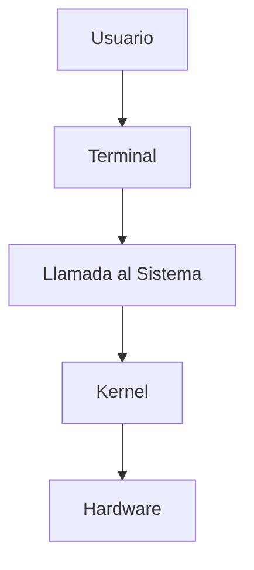

## Prerrequisitos
Para este tutorial necesitaremos:
*   Una máquina virtual con Linux (Ubuntu/Debian).
*   Acceso a la terminal con permisos de sudo.

## Resumen del Tutorial
En esta práctica aprenderás a navegar por las entrañas del sistema operativo. Utilizaremos comandos como `uname`, `lsmod` y exploraremos el sistema de archivos `/proc` para entender cómo el kernel gestiona el hardware y los procesos en tiempo real.

## Diagrama de Flujo

